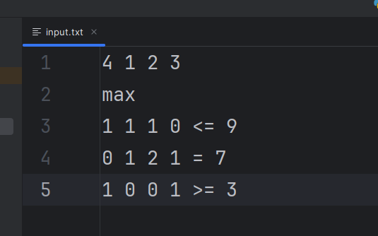
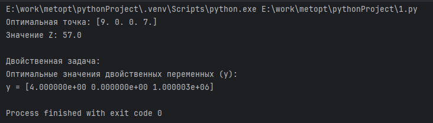
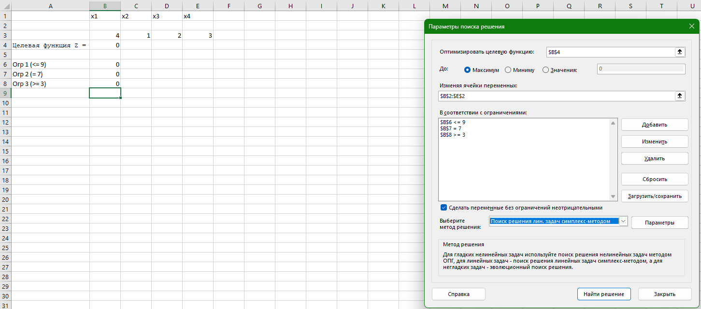
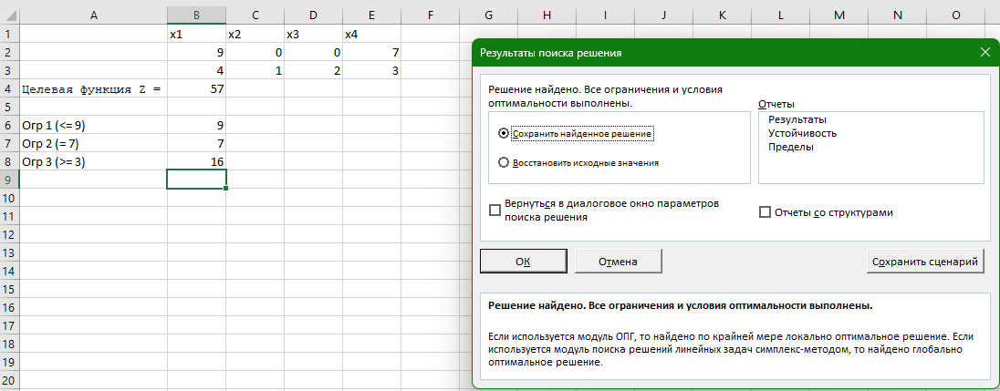

# Лабораторная работа: Решение задачи линейного программирования (ЗЛП)

**Студент:** Шукалов Андрей Денисович 

**Группа:** К3339

**Вариант:** 3  

## 1. Математическая постановка задачи
**Целевая функция:**  
$Z = 4x_1 + x_2 + 2x_3 + 3x_4 \to \max$

**Ограничения:**  
1. $x_1 + x_2 + x_3 \le 9$  
2. $x_2 + 2x_3 + x_4 = 7$  
3. $x_1 + x_4 \ge 3$  
$x_1, x_2, x_3, x_4 \ge 0$

## 2. Инструкция по запуску
1. Установить Python 3.x и библиотеку `numpy` (`pip install numpy`).
2. Создать файл `input.txt` в корневой папке.
3. Запустить командой `python 1.py`.

## 3. Описание алгоритма решения

1. **Инициализация**
   - Считывание коэффициентов из `input.txt`.
   - Определение количества основных и дополнительных переменных.
2. **Приведение к канонической форме:**
   - Добавление $S_1$ (sumFirst) для первого ограничения.
   - Добавление $S_2$ (sumSecond) и $A_1$ (artFirst) для третьего.
   - Добавление $A_2$ (artSecond) для второго.
3. **Метод больших штрафов (M-метод):**
   - Формирование расширенной симплекс-таблицы.
   - Введение коэффициента $-M$ ($M=10^6$) для искусственных переменных $A_1, A_2$ в целевую строку.
   - Предварительное обнуление коэффициентов при искусственных переменных в строке индикаторов.
4. **Симплекс-итерации:**
   - **Поиск ведущего столбца:** Выбор индекса $j$, для которого $\Delta_j < 0$ (наибольший по модулю).
   - **Проверка на неограниченность:** Если все элементы столбца $\le 0$, решение отсутствует.
   - **Поиск ведущей строки:** Расчет симплексных отношений $\theta_i = b_i / a_{ij}$ для $a_{ij} > 0$. Выбор строки с минимальным $\theta$.
   - **Пересчет таблицы:** Использование метода Гаусса-Жордана (преобразование ведущего элемента в 1, остальных элементов столбца в 0).
5. **Проверка оптимальности:** 
   - Если все $\Delta_j \ge 0$, процесс завершен. 
   - Проверка: если в базисе остались искусственные переменные с ненулевым значением — задача не имеет допустимых решений.

## 4. Демонстрация и пояснение работы программы

В файле заданы коэффициенты целевой функции (4, 1, 2, 3), тип задачи (max) и матрица ограничений с типами неравенств. Это позволяет программе автоматически определить количество необходимых дополнительных переменных.

**Вывод программы в консоль**  

Программа выдает результат $x = [9, 0, 0, 7]$. Это означает, что переменные $x_2$ и $x_3$ вышли из базиса (стали равны 0), а $x_1$ и $x_4$ приняли значения 9 и 7 соответственно. Итоговое значение $Z = 57.0$. Отсутствие искусственных переменных в финальном базисе подтверждает, что найдено допустимое оптимальное решение.

## 5. Сравнение с MS Excel (Поиск решения)
**Окно параметров «Поиска решения»**  

Здесь видно, что выбрана целевая ячейка Z, указаны изменяемые ячейки $x_1-x_4$ и добавлены три ограничения согласно варианту. Выбран метод «Симплекс-метод», что гарантирует идентичность алгоритмов.

**Итоговый результат Excel**  

Excel подтверждает расчеты программы. В точке (9, 0, 0, 7) достигается максимум 57. Это доказывает корректность программной реализации M-метода и логики перехода между базисами.

## 7. Рефлексивынй вывод
В процессе выполнения работы я изучил работу симплекс метода и симплекс таблиц. Главной сложностью была реализация M-метода: без предварительного обнуления оценок искусственных переменных алгоритм выдавал неверные направления поиска.